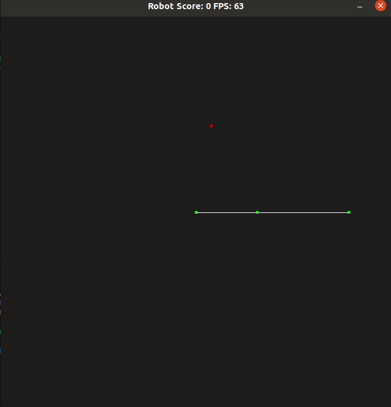

# CPPND: Capstone - A basic Game - Robot Arm 

This is a basic game written in C++ using SDL Library for the Capstone project in the [Udacity C++ Nanodegree Program](https://www.udacity.com/course/c-plus-plus-nanodegree--nd213).

A simple 2D robot arm game developed using C++ and SDL2. The game simulates a robot arm with two links and an end-effector. The goal of the game is to move the end-effector of the robot arm to randomly placed targets within the workspace.

## Features

- Control of a 2D robot arm with two links using the keyboard
- Collision detection between the end-effector and targets
- Scoring system based on the number of targets reached
- Real-time rendering of the robot arm, targets, and score

## Controls

- `Up Arrow`/`Down Arrow`: Rotate the base joint (first joint) of the robot arm
- `Left Arrow`/`Right Arrow`: Rotate the elbow joint (second joint) of the robot arm
- `ESC`: Quit the game

## Dependencies for Running Locally
* cmake >= 3.7
  * All OSes: [click here for installation instructions](https://cmake.org/install/)
* make >= 4.1 (Linux, Mac), 3.81 (Windows)
  * Linux: make is installed by default on most Linux distros
  * Mac: [install Xcode command line tools to get make](https://developer.apple.com/xcode/features/)
  * Windows: [Click here for installation instructions](http://gnuwin32.sourceforge.net/packages/make.htm)
* gcc/g++ >= 5.4
  * Linux: gcc / g++ is installed by default on most Linux distros
  * Mac: same deal as make - [install Xcode command line tools](https://developer.apple.com/xcode/features/)
  * Windows: recommend using [MinGW](http://www.mingw.org/)
* SDL2 
   * Refer to https://wiki.libsdl.org/SDL2/Installation

## Basic Build Instructions

1. Clone this repo.
2. Make a build directory in the top level directory: `mkdir build && cd build`
3. Compile: `cmake .. && make`
4. Run it: `./RobotArmGame`.